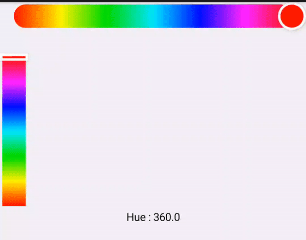

# HSVPicker for compose

HSVPicker is an easy and highly customizable HSV picker library for Android.

- It's a customizable color picker library for Hue, Saturation, Value, and Alpha.
- Resizable/Customizable slider and panel.
- 100% Compose view

 |   

## Compose version

**Current support compose version : 1.1.x**

> ⚠️ **Ensure you are using same version with our support Compose version**: If it's not, it will choose your highest Compose version via transitive dependencies.

## Download

You can use Gradle :

```gradle
dependencies {
   implementation 'io.github.naverz.pinocchio:hsvpicker-compose:1.0.2'
}
```


## How do I use HSVPicker?

### Basic usage

The sample code is [here!](../app/src/main/kotlin/io/github/naverz/hsvpicker/MainActivityCompose.kt)

```kotlin

@Composable
fun Sample() {
    var hue by remember {
        mutableStateOf(0f)
    }
    var saturation by remember {
        mutableStateOf(1f)
    }
    var value by remember {
        mutableStateOf(1f)
    }
    var alpha by remember {
        mutableStateOf(1f)
    }

    Column(
        Modifier
            .fillMaxWidth()
            .background(Color(0xffd3d3d3))
    ) {
        Box(
            modifier = Modifier
                .fillMaxWidth()
                .weight(1f)
                .padding(20.dp)
                .background(
                    Color.hsv(hue, saturation, value, alpha),
                    RoundedCornerShape(defaultCornerRadius)
                )
        )
        Row {
            Column(Modifier.weight(1f)) {
                HueSlider(
                    hue = hue,
                    isVertical = false,
                    onHueChanged = { hue = it }
                )
                SaturationValuePanel(
                    Modifier
                        .fillMaxWidth()
                        .height(200.dp),
                    saturation = saturation,
                    value = value,
                    hue = hue,
                    alpha = alpha,
                    onSaturationValueChanged = { newSaturation: Float, newValue: Float ->
                        saturation = newSaturation
                        value = newValue
                    }
                )

            }
            AlphaSlider(
                Modifier
                    .height(200.dp),
                alpha = alpha,
                isVertical = true,
                thumbBackgroundColor = Color.White,
                onAlphaChanged = { alpha = it }
            )
        }
        Box(
            Modifier
                .align(Alignment.CenterHorizontally)
                .padding(top = 10.dp, bottom = 20.dp)
        ) {
            BasicText(
                modifier = Modifier
                    .background(Color.White),
                text = "hue : $hue\nsaturation : $saturation\nvalue: $value\nalpha : $alpha"
            )
        }
    }
}
```

### Options

#### HueSlider

```kotlin
fun HueSlider(
    modifier: Modifier = Modifier,
    @FloatRange(from = 0.0, to = 360.0)
    hue: Float = DEFAULT_HSV_HUE,
    thumb: @Composable () -> Unit,
    isVertical: Boolean = false,
    sliderWidth: Dp = defaultSliderWidth,
    sliderCornerRadius: Dp = defaultCornerRadius,
    sliderStroke: Stroke? = null,
    sliderElevation: Dp? = null,
    onHueChanged: ((hue: Float) -> Unit)? = null,
    onHueConfirmed: ((hue: Float) -> Unit)? = null,
)

fun HueSlider(
    modifier: Modifier = Modifier,
    @FloatRange(from = 0.0, to = 360.0)
    hue: Float = DEFAULT_HSV_HUE,
    isVertical: Boolean = false,
    thumbSize: DpSize = defaultThumbSize,
    thumbShape: Shape = CircleShape,
    thumbStroke: Stroke? = defaultThumbStroke,
    thumbBackgroundColor: Color? = null,
    thumbElevation: Dp? = null,
    sliderWidth: Dp = defaultSliderWidth,
    sliderCornerRadius: Dp = defaultCornerRadius,
    sliderStroke: Stroke? = null,
    sliderElevation: Dp? = null,
    onHueChanged: ((hue: Float) -> Unit)? = null,
    onHueConfirmed: ((hue: Float) -> Unit)? = null,
)
```

#### SaturationValuePanel

```kotlin
fun SaturationValuePanel(
    modifier: Modifier = Modifier,
    @FloatRange(from = 0.0, to = 360.0)
    hue: Float,
    @FloatRange(from = 0.0, to = 1.0)
    saturation: Float,
    @FloatRange(from = 0.0, to = 1.0)
    value: Float,
    @FloatRange(from = 0.0, to = 1.0)
    alpha: Float = DEFAULT_ALPHA,
    thumb: @Composable () -> Unit,
    panelCornerRadius: Dp = defaultCornerRadius,
    panelStroke: Stroke? = null,
    panelElevation: Dp? = null,
    onSaturationValueChanged: ((saturation: Float, value: Float) -> Unit)? = null,
    onSaturationValueConfirmed: ((saturation: Float, value: Float) -> Unit)? = null,
)
```

```kotlin
fun SaturationValuePanel(
    modifier: Modifier = Modifier,
    @FloatRange(from = 0.0, to = 360.0)
    hue: Float,
    @FloatRange(from = 0.0, to = 1.0)
    saturation: Float,
    @FloatRange(from = 0.0, to = 1.0)
    value: Float,
    @FloatRange(from = 0.0, to = 1.0)
    alpha: Float = DEFAULT_ALPHA,
    thumbSize: DpSize = defaultThumbSize,
    thumbStroke: Stroke = defaultThumbStroke,
    thumbShape: Shape = CircleShape,
    thumbBackgroundColor: Color? = null,
    thumbElevation: Dp? = null,
    panelCornerRadius: Dp = defaultCornerRadius,
    panelStroke: Stroke? = null,
    panelElevation: Dp? = null,
    onSaturationValueChanged: ((saturation: Float, value: Float) -> Unit)? = null,
    onSaturationValueConfirmed: ((saturation: Float, value: Float) -> Unit)? = null,
)
```

#### AlphaSlider

```kotlin
fun AlphaSlider(
    modifier: Modifier = Modifier,
    @FloatRange(from = 0.0, to = 1.0)
    alpha: Float = DEFAULT_ALPHA,
    thumb: @Composable () -> Unit,
    isVertical: Boolean = false,
    sliderWidth: Dp = defaultSliderWidth,
    sliderCornerRadius: Dp = defaultCornerRadius,
    sliderStroke: Stroke? = null,
    sliderElevation: Dp? = null,
    onAlphaChanged: ((alpha: Float) -> Unit)? = null,
    onAlphaConfirmed: ((alpha: Float) -> Unit)? = null,
)
```

```kotlin
fun AlphaSlider(
    modifier: Modifier = Modifier,
    @FloatRange(from = 0.0, to = 1.0)
    alpha: Float = DEFAULT_ALPHA,
    isVertical: Boolean = false,
    thumbSize: DpSize = defaultThumbSize,
    thumbShape: Shape = CircleShape,
    thumbStroke: Stroke? = null,
    thumbBackgroundColor: Color? = null,
    thumbElevation: Dp? = null,
    sliderWidth: Dp = defaultSliderWidth,
    sliderCornerRadius: Dp = defaultCornerRadius,
    sliderStroke: Stroke? = null,
    sliderElevation: Dp? = null,
    onAlphaChanged: ((alpha: Float) -> Unit)? = null,
    onAlphaConfirmed: ((alpha: Float) -> Unit)? = null,
)
```

### Sample Usage

You could check the sample code in [this sample module](../sample/src/main/kotlin/io/github/naverz/hsvpicker/sample/MainActivityCompose.kt)

## Contribution

Feel free to report any issues or any contributions :).\
Any kind of contributions is welcome!
