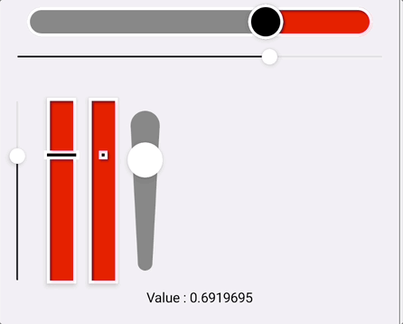
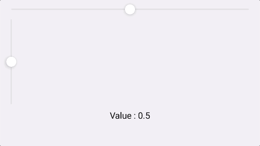
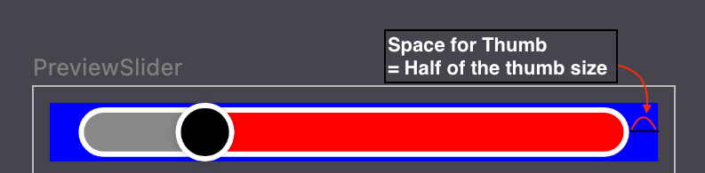
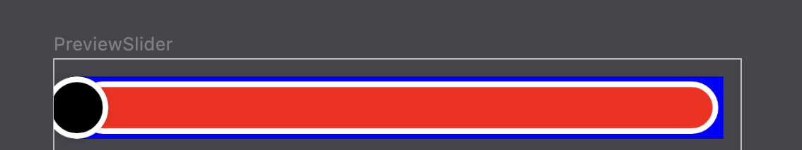
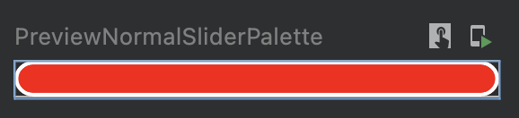
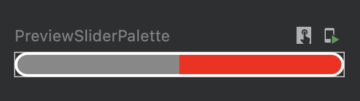
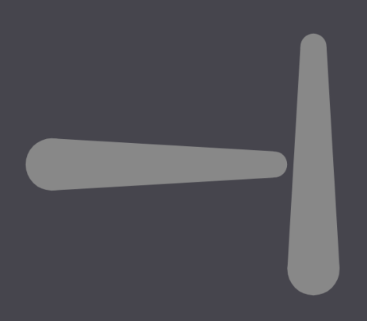
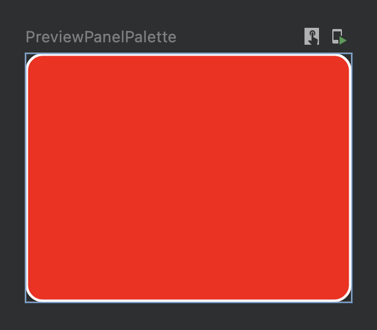
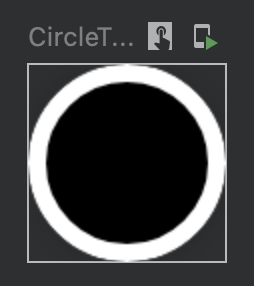
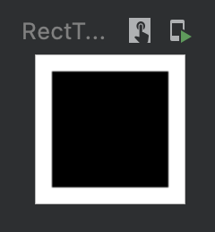

# Slider compose 

  | 
 | 
  |

## Compose versions

<table>
 <tr>
  <td>Compose 1.1 (1.1.x)</td><td></td>
 </tr>
 <tr>
  <td>Compose UI 1.2 (1.2.x)</td><td></td>
 </tr>
 <tr>
  <td>Compose UI 1.3 (1.3.x)</td><td></td>
 </tr>
 <tr>
  <td>Compose UI 1.4 (1.4.x)</td><td></td>
 </tr>
</table>

## Download

You can use Gradle :
```gradle
dependencies {
   implementation 'io.github.naverz.pinocchio:slider-compose:<version>'
}
```

## How do I use Slider compose?

### Basic usage

### Slider 
```kotlin
var value by remember {
    mutableStateOf(0f)
}

Slider(
    Modifier
        .fillMaxWidth()
        .padding(horizontal = 10.dp),
    value = value,
    slider = {
        // You can also use your custom composable for the slider area.
        SliderPalette.ActiveSlider(
            activeValue = value,
            sliderWidth = 2.dp,
            isVertical = false,
            activeBrush = SolidColor(Color(0xff292930)),
            inactivateBrush = SolidColor(Color(0xffE0E0E1)),
            sliderCornerShape = RoundedCornerShape(4.dp),
        )
    },
    isVertical = false,
    thumb = {
        // You can also use your custom composable for the thumb.
        ThumbPalette.CircleThumb(
            thumbRadius = 8.dp,
            color = Color.White,
            thumbElevation = 4f.dp
        )
    },
    onValueChanged = { value = it },
    onValueConfirmed = { 
        // When it's an ACTION_UP touch event occurred.
    }
)
```
### SliderPanel
```kotlin
var x by remember {
    mutableStateOf(0f)
}
var y by remember {
    mutableStateOf(0f)
}

SlidePanel(
    Modifier
        .fillMaxWidth()
        .height(200.dp)
        .padding(20.dp),
    x = x,
    y = y,
    onValueChanged = { newX: Float, newY: Float ->
        x = newX
        y = newY
    },
    onValueConfirmed = { 
        // When it's an ACTION_UP touch event occurred.
    },
    panel = {
        // You can also use your custom composable for the panel area.
        PanelPalette.Panel(
            panelBackground = Background.ColorShape(
                color = Color.Red,
                shape = RoundedCornerShape(defaultCornerRadius)
            ),
            panelStroke = Stroke.WidthColor(defaultThumbStrokeWidth, Color.White),
            elevation = 4f.dp
        )
    },
    thumb = {
        // You can also use your custom composable for the thumb.
        ThumbPalette.CircleThumb(
            thumbRadius = defaultThumbRadius + defaultThumbStrokeWidth,
            color = Color.Black,
            thumbStroke = Stroke.WidthColor(defaultThumbStrokeWidth, Color.White),
            thumbElevation = 4f.dp
        )
    }
)
```

## How to remove the thumb space
Slider and SliderPanel have a padding amount of the half thumb size to prevent the thumb to be out of Composable area. But You can use the layout function in Modifier as follows to fit your Slider, SliderPanel area to your content container.


```kotlin
SliderPanel(
    modifier = Modifier
        .fillMaxSize()
        .layout { measurable, constraints ->
            val overriddenWidth = constraints.maxWidth + 2 * SPACE_FOR_THUMB
            val overriddenHeight = constraints.maxHeight + 2 * SPACE_FOR_THUMB
            val placeable =
                measurable.measure(
                    constraints.copy(
                        maxWidth = overriddenWidth,
                        maxHeight = overriddenHeight
                    )
                )
            layout(placeable.width, placeable.height) {
                placeable.place(0, 0)
            }
        },
        ...
```

* Before
  
    

* After
  
    


## Palette
We serve UI components for the custom Composable parameter (e.g thumb, panel, slider). Please, Open new PR, If you guys have some good ideas for the palette composable.


### Slider Palette



```kotlin
SliderPalette.NormalSlider(
    isVertical = false,
    sliderWidth = 30.dp,
    sliderBackground = Background.ColorShape(
        Color.Red,
        RoundedCornerShape(21.dp)
    ),
    sliderStroke = Stroke.WidthColor(3.dp, Color.White),
    sliderElevation = 4.dp,
)
```



```kotlin
 SliderPalette.ActiveSlider(
    activeValue = 0.5f,
    sliderWidth = 30.dp,
    isVertical = false,
    activeBrush = SolidColor(Color.Gray),
    inactivateBrush = SolidColor(Color.Red),
    sliderCornerShape = RoundedCornerShape(defaultCornerRadius),
    sliderStroke = Stroke.WidthColor(3.dp, Color.White),
)
```


```kotlin
SliderPalette.BalancingSlider(
    value = value,
    sliderWidth = 2.dp,
    isVertical = false,
    activeBrush = SolidColor(Color(0xff292930)),
    inactivateBrush = SolidColor(Color(0xffE0E0E1)),
    sliderCornerShape = RoundedCornerShape(4.dp),
)

```



```kotlin
SliderPalette.NarrowSlider(
    property = NarrowSliderProperty(
      startPeekWidth = 30.dp,
      endPeekWidth = 15.dp
    ),
    isVertical = false, 
    sliderWidth = 150.dp,
    sliderHeight = 30.dp
)

```


### Panel Palette


```kotlin
PanelPalette.Panel(
    panelBackground = Background.ColorShape(
        color = Color.Red,
        shape = RoundedCornerShape(defaultCornerRadius)
    ),
    panelStroke = Stroke.WidthColor(defaultThumbStrokeWidth, Color.White),
    elevation = 4f.dp
)
```

### Thumb Palette


```kotlin
ThumbPalette.CircleThumb(
    thumbRadius = 18.dp,
    color = Color.Black,
    thumbStroke = Stroke.WidthColor(3.dp, Color.White),
    thumbElevation = 4f.dp
)
```



```kotlin
ThumbPalette.RectThumb(
    thumbSize = DpSize(
        30.dp,
        30.dp
    ),
    color = Color.Black,
    thumbStroke = Stroke.WidthColor(3.dp, Color.White),
    thumbElevation = 4f.dp
)
```

## All composable has previews!

Search with the `@Preview` keyword in this project!
